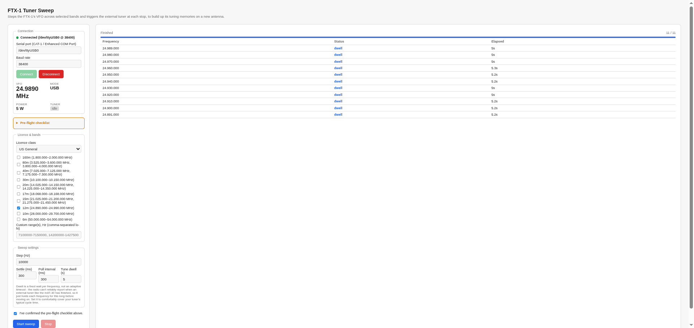

# FTX-1 Tuner Sweep

A local browser app that automates building tuning memories into an external
antenna tuner on a Yaesu FTX-1: it steps the radio's VFO across whatever
amateur bands you pick and triggers the tuner at each stop, so that after one
sweep the tuner can recall a near-instant match anywhere across that range —
useful any time you put the radio on a new or different antenna.



## Who this is for

You'll want this if you have:

- A **Yaesu FTX-1** (Field or Optima), controlled over its USB CAT interface
- An **external automatic antenna tuner** wired to its TUNER/LINEAR jack —
  built and tested against a **mAT-Tuner mAT-30**, but the CAT commands are
  generic enough to likely work with any tuner using the same Yaesu
  FC-30/FC-40 style trigger
- A reason to re-tune across a band range in one go instead of one frequency
  at a time — a new antenna, a new location, or just wanting your tuner's
  memories filled in before you're mid-QSO

If you don't have this exact radio, the CAT protocol layer
(`ftx1_cat.py`) and the sweep/telemetry logic in `app.py` are still a
reasonably clean reference for building the same thing against another
Yaesu CAT-capable rig.

**Developed and field-tested with a Yaesu FTX-1 Optima and a mAT-Tuner
mAT-30**, on 15m and 12m.

## Features

- **Browser UI**, no radio required just to look around — bands, license
  privileges, and sweep settings are all visible before you ever connect
- **Live telemetry** once connected: VFO, mode, configured power, and
  whether the tuner is actively cycling
- **License-aware band selection** driven by a plain-text, user-editable
  TSV (`bandplans.tsv`) — pick US Technician/General/Extra (exact, sourced
  from 47 CFR §97.301) or a handful of other countries' approximate
  reference allocations, and only the frequencies you're actually allowed
  to use show up as sweepable
- **Sensible sweep math**: ascending frequency order, each range's first
  and last points nudged inside the band edge, everything in between on a
  clean 10 kHz grid
- **Live-updating sweep log**: each frequency shows as "tuning…" the moment
  it's set, then flips to its final status once the dwell completes

## Licenses, bands, and band segments

Frequency privileges come from `bandplans.tsv`, not hardcoded logic - see
[docs/band-privileges.md](docs/band-privileges.md) for the full picture, but
briefly:

- Pick a **license class** from the dropdown (US Technician/General/Extra
  are exact, sourced from 47 CFR §97.301; Canada/Europe/Japan/Central &
  South America are approximate outer-bound reference allocations, clearly
  flagged as such - there's no single verified table for those yet).
- The **band checkboxes update per license** to show only what that license
  is actually allowed to sweep. A band with a mode-restricted split - e.g.
  US General's 80m, which has a separate CW/data segment and phone segment
  with a gap between them that's Extra-only - shows as multiple ranges
  under the same checkbox, and checking it sweeps every listed segment, not
  the gap.
- You can also type a **custom Hz range** as an escape hatch, independent
  of license.

### Staying off the edges

Within each segment being swept, the first frequency is nudged **1 kHz
above** the segment's lower edge and the last frequency **1 kHz below** its
upper edge, so the sweep never transmits exactly on a hard boundary.
Everything in between lands on a clean 10 kHz grid. For example, US
General's 80m phone segment (3.800-4.000 MHz) sweeps as 3.801, then
3.810, 3.820, ... 3.990, then 3.999 - not 3.800 or 4.000 themselves.
Segments selected together (multiple bands, or a band plus a custom range)
are swept in one ascending sequence, low to high.

## Please operate courteously

Every sweep step is a real, if brief, transmission with no way to sense
whether the frequency is already in use before it keys up. Only run a sweep
when the segment looks dead or nearly so - listen first - and hit **Stop**
immediately if you're about to cross a QSO, net, or beacon. Use the minimum
power that still gets a reliable tune (**5 W or less**); there's no benefit
to tuning at higher power; it only adds needless interference potential and
strain on the tuner's relays over a whole sweep.

## Requirements

- Python 3.9+
- The FTX-1's Silicon Labs CP2105 USB driver (built into Linux; a separate
  install on Windows/macOS — see [docs/usage.md](docs/usage.md))

## Quick start

```sh
pip install -r requirements.txt
python app.py
```

Then open **http://127.0.0.1:5000**.

## Documentation

- **[docs/usage.md](docs/usage.md)** — physical setup, required radio menu
  settings, and a pre-flight checklist before running a real sweep. Start
  here.
- **[docs/band-privileges.md](docs/band-privileges.md)** — how
  `bandplans.tsv` works, what's verified vs. approximate, and how to add
  your own country/license class.

## Project layout

```
app.py               Flask app: routes, connection state, sweep + poller threads
ftx1_cat.py           FTX-1 CAT protocol (FA/AC/RI/PC/MD) and the TSV loader
bandplans.tsv          License classes and legal frequency ranges (edit me)
templates/index.html   The browser UI (self-contained, no build step)
refs/                  Source docs: Yaesu CAT manual, 47 CFR 97.301, CEPT novice rec.
docs/                  Usage guide and band-privileges notes
```

## Status

Built directly from Yaesu's FTX-1 CAT Operation Reference Manual. One
caveat found during field testing and worth knowing up front: the FTX-1
doesn't reliably report when an *external* tuner has finished its cycle, so
the sweep uses a fixed per-frequency dwell rather than adaptive completion
detection - see [docs/usage.md](docs/usage.md) for how to tune that
setting.

Read the pre-flight checklist in the UI and in the docs before pointing
this at an antenna.

## License

MIT — see [LICENSE](LICENSE). Use it, change it, no warranty.
