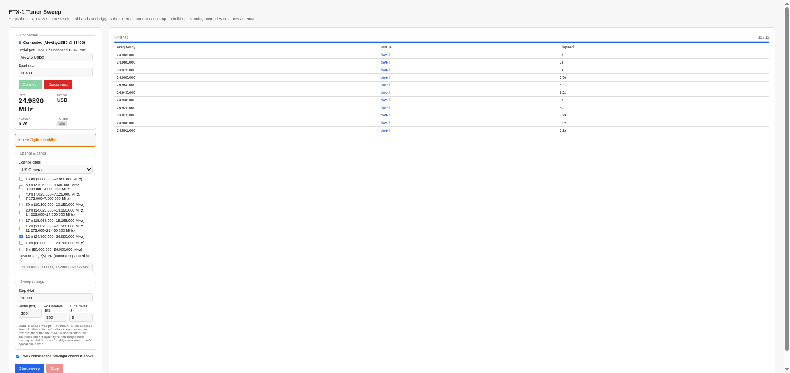
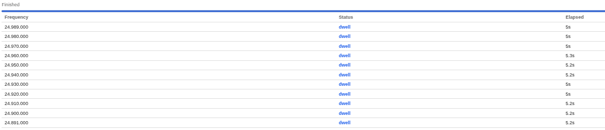
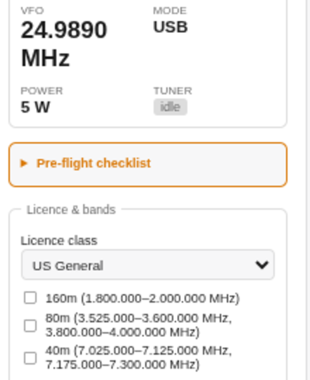
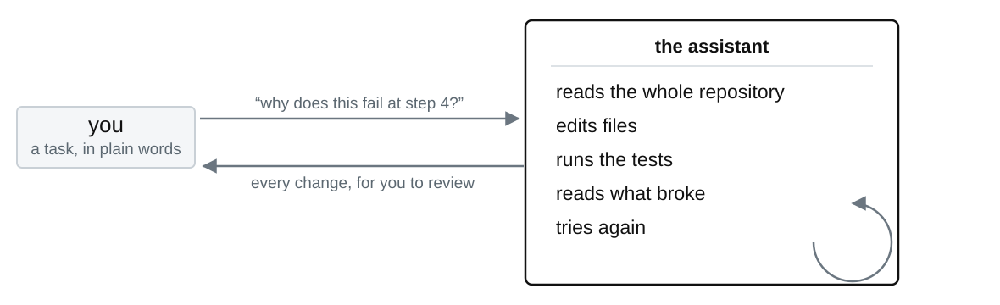
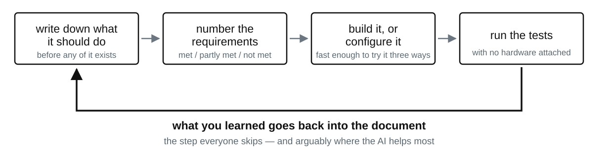
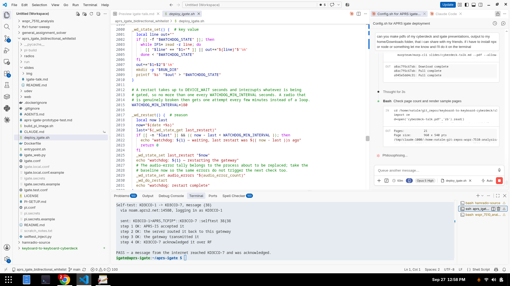

<!-- _class: title -->
<!-- _paginate: false -->
<!-- _footer: "" -->

# Teaching an antenna tuner a whole band, unattended

**KD3CCO**

A CAT-controlled band sweep for the FTX-1 and an external tuner

---

# An external tuner is instant on a frequency it has already seen, and slow on one it has not

The mAT-30 stores a tuning memory per frequency. Once it has learned a band it snaps to a match almost immediately.

The learning is the part nobody tells you about. **A new antenna means every one of those memories is empty again** — and I change antennas often, because that is most of what this hobby is.

---

# So the job was: turn the VFO, hold the tuner button, wait, repeat, one hundred times

Walking a band by hand at 10 kHz steps is fine for two test points and miserable for a whole band.

It is also exactly the kind of work a computer should be doing: the radio has a CAT port, and the tuner trigger is a command on it.

---

<!-- _class: evidence -->

# So it is a local web page that steps the radio and triggers the tuner at every stop



<span class="caption">Connection and live telemetry on the left, the sweep log on the right. Runs on the same laptop or Pi that is already plugged into the radio.</span>

---

<!-- _class: evidence -->

# One click builds a band's worth of tuner memories while you do something else



<span class="caption">A completed 12 m sweep: eleven stops at 10 kHz, 5 watts, about five seconds each, no intervention.</span>

---

# Three CAT commands do all of the real work

```
FA   set or read the VFO frequency
AC   the antenna tuner: which one, and off / on / start tuning
RI   read back radio status, including a "tuner is cycling" bit
```

`AC` set to **external tuner, start tuning** is functionally identical to holding the front-panel TUNER button for two seconds — which is the trigger the mAT-30 is already wired to on the TUNER/LINEAR jack.

The FTX-1 is new enough that there was no tested command reference to copy. I worked from Yaesu's own CAT manual rather than from somebody's forum post, and that is the only reason this worked on the first real attempt.

---

# The gotcha: the radio cannot know when an external tuner has finished

My first version polled that `RI` status bit and waited for it to clear. It never cleared. Every step sat there for the full timeout.

Once you look at the wiring it is obvious: **the trigger line is one-way**. The tuner does its own SWR search and has no path to tell the radio it is done. The radio can track its own internal coupler, because it is driving those relays itself. It cannot track somebody else's box.

So the tool stopped trying to detect completion and holds each frequency for a fixed five seconds instead. Simpler, and it works.

---



<!-- _class: panel -->

# The band list is driven by your license class, not by a hard-coded band plan

A plain text file of license classes and their legal segments. The checkboxes only offer what that class may actually use.

US figures came from **47 CFR §97.301** itself, not from a summary site — so 80 m sweeps the CW/data segment and the phone segment, and skips the Extra-only gap in between.

---

# It refuses to transmit on a band edge, and it leaves the tuner in circuit

**Edge padding.** The first stop in a segment lands 1 kHz above its lower edge and the last 1 kHz below its upper edge. US General 80 m phone sweeps 3.801, 3.810 … 3.990, 3.999 — never 3.800 or 4.000 themselves.

**A sane state afterwards.** An early version left the tuner bypassed at the end of a sweep, so I would come back to a radio that was worse than before I started. It now leaves the tuner enabled however the sweep ends — finished, stopped, or the USB cable pulled out.

---

# Every step is a real transmission, and the tool cannot hear the band

It keys up where it is told to. It has no idea whether somebody is already there.

So: only when the band sounds dead, at the lowest power that gets a reliable tune — 5 watts has been plenty — with a pre-flight checklist you have to tick and a stop button under my finger.

**That constraint is a requirement, not a disclaimer.** It is why the checklist and the stop button exist at all.

---

<!-- _class: evidence -->

# An AI coding assistant reads your whole repository, and that changes which projects are worth starting



Hobby time arrives as confetti: twenty minutes before dinner, an hour on a Sunday. What decides whether a project happens is not the work in it — it is how much progress fits inside one of those fragments. A sweep tool with a band plan built from the regulation itself was never going to happen otherwise.

---

<!-- _class: evidence -->

# The gain is not just faster and better code — it is the practices the AI made affordable



<span class="caption">Interfaces, failure modes and what happens when a part is missing, all decided in the document before anything exists. Here it produced a pre-flight checklist you must tick, band limits taken from 47 CFR §97.301 rather than a summary site, and both reference manuals checked into the repository.</span>

---

# Its best trick is telling me what I did not know to ask

**Argue with it for an hour at two in the morning** without spending a friend's patience. In a solo hobby, that back-and-forth was the scarce ingredient.

**Then turn it against your own design.** I write down how I think something should work, and ask for an analysis of alternatives — and specifically: *does this design imply there are tools, techniques or facts out there that I am not accounting for?*

It is a retrieval system over what other people have already worked out. Use it as one.

---

<!-- _class: evidence -->

# Code, documentation, slides and the blog in one window, where the assistant can see all of it



<span class="caption">Documentation is markdown in the repository, beside the code. Everything advances in the same sitting, so nothing drifts. The blog is another repository in the same workspace; these slides are markdown in this one.</span>

---

<!-- _class: closing -->

# If a thing in your shack is tedious and repeatable, it is a project

**Code, the CAT reference, and the band plan file**
github.com/hatandspecs/ftx1-tuner-sweep

**Write-up, including both things I got wrong**
hatandspecs.github.io/hamradio/articles/ftx1-tuner-sweep/

The CAT layer is a reasonable starting point for any Yaesu with a tuner jack.

**KD3CCO** — questions welcome
